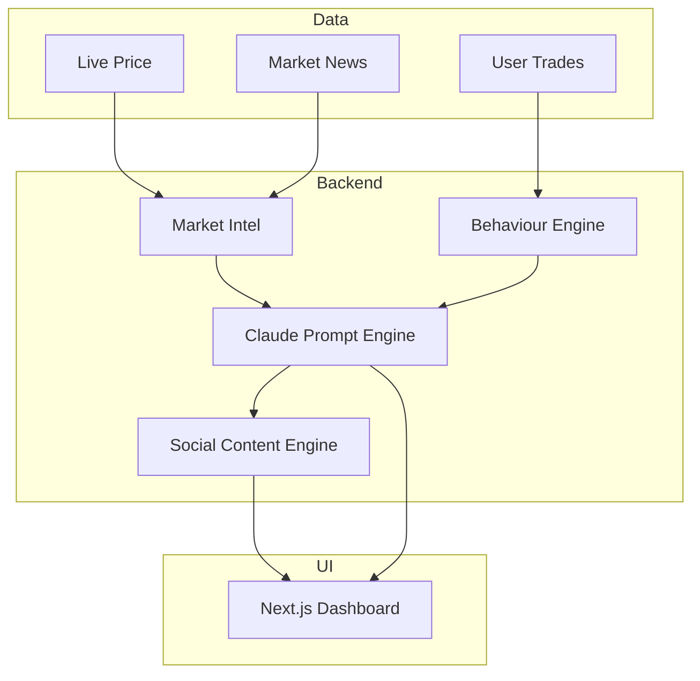

# Claude.md — Intelligent Trading Analyst

## Understand Markets · Coach Behaviour · Create Content

**1-Day Hackathon Build · Live Demo · No Predictions**

Owner: Team Helix

Role: Hongbo Wei - Applied AI Engineer (Claude Code executes)

Mode: Explain-only · Compliant · Brand-safe

---

# 0. Mission

> Use GenAI to help traders:
>
> * Understand market moves
> * Analyse their own behaviour
> * Share trusted content that builds community

Inspired by how pros have analyst teams and trading coaches. Retail traders have Google — we fix that.

---

# 1. What You’ll Demo (Definition of Done)

✅ Real-time market explanation ("Why did this move?")

✅ Behaviour pattern awareness ("You tend to Y when X happens")

✅ Persona-generated social content (LinkedIn + X)

✅ Full UI: desktop-first dashboard

✅ No signals, predictions, or advice

✅ Working, live system (no slides)

---

# 2. Core Problem

Retail traders face two gaps:

### 🧠 Market understanding

* "Price dropped 5% — I don’t know why."
* "Too much info, I don’t know what matters."
* "No Bloomberg terminal, just Twitter."

### 💥 Behaviour awareness

* "Didn’t realise I was on a losing streak."
* "I revenge trade but never notice until too late."
* "In the moment, I don't know I'm being emotional."

### 📣 Content creation

* "No time to write quality insights."
* "Don’t trust most market voices online."

Platforms help you click buttons — not think. We change that.

---

# 3. Architecture



---

# 4. Feature Modules

## 4.1 Market Intelligence

* Detect spikes >1.5% in 5m
* Explain using RSI/ATR + news
* Generate brief insights (1–2 sentences)
* Personalise to watched symbols ("why EUR/USD moved")

## 4.2 Behavioural Coaching

* Parse trades.csv: streaks, revenge trades, oversizing
* Detect emotion-related patterns
* Give timely, supportive nudges (no blocks)
* Celebrate healthy habits ("You traded 3 sessions without over-sizing")

## 4.3 Claude Prompt Layer

Fusion engine:

```txt
Market: {event}
User: {behaviour}
Write 1 sentence: coaching tone. No signal. No advice.
```

Example:
"Market dropped 2%. You tend to double size after losses — consider pausing."

## 4.4 Social Persona Engine

* Create daily/weekly content
* Channels: LinkedIn (pro tone), X (punchy threads)
* Personas:

  * Calm Analyst
  * Data Nerd
  * Trading Coach
* Output:

  * Event explainer
  * Educational thread
  * Weekly brief
  * “You-trade-like-this” chart post

---

# 5. Frontend

## 🧱 Stack

* **Framework**: React + Next.js (App Router)
* **Styling**: TailwindCSS + shadcn/ui + Radix
* **Charts**: Recharts or Victory (SVG, accessible)
* **Figma Sync**: Design tokens auto-injected via Style Dictionary

## 🔤 Layout

```
src/
├── app/                → layout.tsx, dashboard/page.tsx
├── components/         → Sidebar, Header, ui/
├── lib/                → api.ts
├── styles/             → Tailwind globals
└── tailwind.config.js  → with Figma tokens
```

## 🧽 UX Highlights

* Desktop-first, responsive fallback
* Sidebar nav + topbar search/profile
* Keyboard shortcuts (`/` for search)
* Cards: "Why it moved", "Your pattern", "Post preview"
* Accessible (ARIA), performant (lazy-loaded charts)

---

# 6. APIs

### `GET /market`

→ Returns live context + market move summary

### `POST /behavior`

→ Returns detected trader pattern + coaching insight

### `POST /content`

→ Returns persona content for LinkedIn/X

---

# 7. Timeline (1-Day Sprint)

| Time  | Task                                     |
| ----- | ---------------------------------------- |
| H0–1  | Scaffold backend/frontend                |
| H1–3  | Market spike detection + LLM explanation |
| H3–5  | Behaviour flagging + insight templates   |
| H5–6  | Claude prompts + content personas        |
| H6–7  | UI dashboard with Tailwind + shadcn/ui   |
| H7–8  | Simulate 3% crash trigger + live test    |
| H8–9  | Add real trades.csv + social outputs     |
| H9–10 | Demo polish + wow moment setup           |

---

# 8. Demo Flow

1. Click “Simulate drop”
2. Market explanation triggers
3. Behaviour insight appears
4. AI generates persona posts
5. One-click share to X/LinkedIn

---

# 9. Constraints (✅ Met)

| Constraint             | Met |
| ---------------------- | --- |
| Live demo only         | ✅   |
| GenAI must add value   | ✅   |
| No predictions/signals | ✅   |
| Supportive only        | ✅   |
| Brand-safe content     | ✅   |

---

# 10. Mind-Blow Moments

* "Market did X, and based on your history, you do Y"
* Detects revenge trading before it happens
* Posts so clean, no one knows it's AI
* Three personas with distinct tone + fan base
* Deriv becomes trusted market voice

---

# 11. Stack Summary

| Layer    | Stack                                  |
| -------- | -------------------------------------- |
| Backend  | FastAPI + yfinance + Claude API        |
| Frontend | Next.js + Tailwind + Radix + shadcn/ui |
| Infra    | Vercel / Cloudflare Pages              |
| Data     | trades.csv / SQLite (demo)             |
| Charts   | Victory / Recharts                     |
| CI/CD    | ESLint, axe-core, Lighthouse CI        |
| Dev UX   | Storybook, TypeScript, hot reload      |

---

# 12. One-Liner

**Bloomberg Terminal + Trading Coach + Ghostwriter → one AI analyst.**
