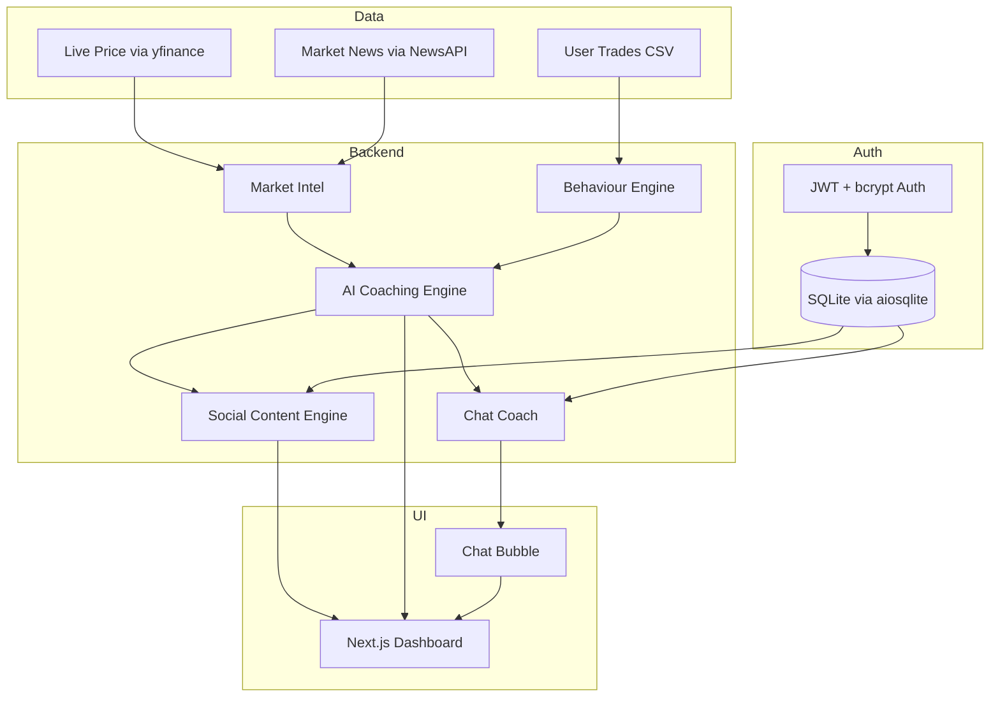

# Claude.md — MarketMind | Intelligent Trading Analyst

## Understand Markets · Coach Behaviour · Create Content

**1-Day Hackathon Build · Live Demo · No Predictions**

Owner: Team Helix

Role: Hongbo Wei - Applied AI Engineer (Claude Code executes)

Mode: Explain-only · Compliant · Brand-safe

---

# 0. Mission

> Use GenAI to help traders:
>
> * Understand market moves
> * Analyse their own behaviour
> * Share trusted content that builds community

Inspired by how pros have analyst teams and trading coaches. Retail traders have Google — we fix that.

---

# 1. What You'll Demo (Definition of Done)

✅ Real-time market explanation ("Why did this move?")

✅ Behaviour pattern awareness ("You tend to Y when X happens")

✅ Persona-generated social content (LinkedIn + X)

✅ Full UI: desktop-first dashboard

✅ No signals, predictions, or advice

✅ Working, live system (no slides)

---

# 2. Core Problem

Retail traders face two gaps:

### 🧠 Market understanding

* "Price dropped 5% — I don't know why."
* "Too much info, I don't know what matters."
* "No Bloomberg terminal, just Twitter."

### 💥 Behaviour awareness

* "Didn't realise I was on a losing streak."
* "I revenge trade but never notice until too late."
* "In the moment, I don't know I'm being emotional."

### 📣 Content creation

* "No time to write quality insights."
* "Don't trust most market voices online."

Platforms help you click buttons — not think. We change that.

---

# 3. Architecture



---

# 4. Feature Modules

## 4.1 Market Intelligence

* Detect spikes >1.5% in 5 minutes
* Simulate 3% drop (volume surge 2.5x) or 8% rise (volume surge 3.0x)
* Technical indicators: RSI (14-period), ATR (14-period), Volume Ratio (vs 20-period avg)
* Explain moves using indicators + news context
* Generate brief insights (1–2 sentences, no predictions)
* Chart endpoint returns historical price data for Recharts rendering
* News integration via NewsAPI with yfinance fallback
* 1-minute caching on market data
* Parallel LLM calls: market explanation + coaching message run via `asyncio.gather()`

## 4.2 Behavioural Coaching

* Parse trades via CSV upload (drag-and-drop) or sample data endpoint

**Negative patterns detected:**
* Loss streak (3+ consecutive losses, severity MEDIUM/HIGH)
* Revenge trade (re-entry within 5 min after loss, 50%+ larger size, severity HIGH)
* Oversizing (75%+ larger than average position, severity MEDIUM)
* Rapid re-entry (multiple trades within 2 min, severity MEDIUM)

**Positive patterns detected:**
* Consistent sizing (last 5 trades within 25% of average)
* No revenge trades (had losses but didn't revenge trade)
* Improving streak (3+ consecutive profitable trades)

**Risk level calculation:**
* HIGH: any HIGH pattern OR 2+ MEDIUM patterns
* MEDIUM: any MEDIUM pattern
* LOW: no negative patterns or only positive

* Supportive, non-directive coaching messages per pattern
* Celebrates healthy habits ("You traded 3 sessions without over-sizing")

## 4.3 AI Coaching Engine

Fusion engine combining market context + user behaviour:

```txt
Market: {event}
User: {behaviour}
Write 1 sentence: coaching tone. No signal. No advice.
```

Example:
"Market dropped 2%. You tend to double size after losses — consider pausing."

**Chat Coach:**
* Multi-turn conversation with full message history
* Tool use: `get_market_with_news` function calling for live data
* Custom system prompts (default from `backend/app/prompts/system_prompt.md`)
* Context-aware fallback responses when API unavailable (loss handling, revenge trading warnings, discipline reminders)
* Auto-saves chat to SQLite when user is authenticated

## 4.4 Social Persona Engine

* Create content per persona + platform combination
* Platforms: LinkedIn (1300 char limit, 2–3 paragraph pro tone), X (280 char limit, punchy single tweet)
* Personas:

  * **Calm Analyst** — measured, thoughtful, reassuring
  * **Data Nerd** — analytical, precise, enthusiastic about numbers
  * **Trading Coach** — supportive, experienced, mentoring
* Output types: event explainer, educational thread, weekly brief, chart post
* Auto-extracted hashtags returned as separate array
* One-click share via native intent URLs (X: `x.com/intent/tweet`, LinkedIn: `linkedin.com/feed/?shareActive=true`)
* One-click copy to clipboard
* Auto-saved to content history when user is authenticated

## 4.5 Auth & Sessions

* JWT tokens (24h expiry) via `python-jose[cryptography]`
* bcrypt password hashing via `passlib[bcrypt]`
* Demo account seeded on startup: `demo@trader.com` / `demo1234`
* Protected routes: all `/dashboard/*` pages via `ProtectedRoute` wrapper
* Token stored in localStorage, sent as `Authorization: Bearer <token>`
* Optional auth on chat/content endpoints (saves history when logged in)

## 4.6 Chat

* Floating chat bubble on dashboard (via `ChatBubble.tsx` + `ChatProvider.tsx`)
* Full-page chat at `/dashboard/chat`
* System prompt loaded from `backend/app/prompts/system_prompt.md`
* Chat history persistence to SQLite (auto-save via background tasks)
* Retrieve/clear history via authenticated endpoints

---

# 5. Frontend

## 🧱 Stack

* **Framework**: React 19 + Next.js 16 (App Router)
* **Language**: TypeScript 5
* **Styling**: Tailwind CSS v4 + shadcn/ui + Radix primitives
* **Charts**: Recharts 3
* **Animation**: Framer Motion 12
* **Icons**: Lucide React
* **Data Fetching**: TanStack React Query 5
* **Notifications**: Sonner (toasts)

## 🔤 Layout

```
frontend/src/
├── app/
│   ├── layout.tsx              → Root layout (providers, fonts)
│   ├── page.tsx                → Landing page
│   ├── globals.css             → Tailwind globals
│   ├── login/page.tsx          → Login page
│   └── dashboard/
│       ├── layout.tsx          → Dashboard shell (sidebar, navbar, protected)
│       ├── page.tsx            → Dashboard home (cards, simulate)
│       ├── chat/page.tsx       → Full-page chat
│       ├── history/page.tsx    → Chat + content history
│       ├── settings/page.tsx   → Theme settings
│       └── vision/page.tsx     → Product vision / intro
├── components/
│   ├── auth/                   → ProtectedRoute
│   ├── cards/                  → MarketCard, BehaviorCard, InsightCard, ContentCard
│   ├── charts/                 → PriceChart (Recharts)
│   ├── chat/                   → ChatBubble, ChatInput, ChatMessageList
│   ├── features/               → SimulateButton, SymbolSelector, ThemeToggle, TradeUpload
│   ├── layout/                 → Navbar, Sidebar
│   ├── providers/              → AuthProvider, ChatProvider, ThemeProvider
│   └── ui/                     → badge, button, card, skeleton, tabs (shadcn/ui)
├── hooks/
│   └── useSessionState.ts      → sessionStorage persistence hook
├── lib/
│   ├── api.ts                  → Backend API client
│   └── utils.ts                → cn() helper
└── types/
    └── index.ts                → Shared TypeScript types
```

## 🧽 UX Highlights

* Desktop-first, responsive fallback
* Collapsible sidebar (expanded 256px / collapsed 64px) with icon tooltips
* Mobile sidebar overlay with backdrop blur
* Floating chat bubble on dashboard pages
* Dark / light / system theme toggle (class-based, persisted to localStorage)
* Session persistence via `useSessionState` hook (survives page refresh)
* CSV drag-and-drop upload for trade data
* Framer Motion card reveal animations
* Skeleton loading states for progressive UI
* Keyboard nav: sidebar items + chat input

---

# 6. APIs

All endpoints are prefixed with `/api/v1`.

### Auth

* `POST /auth/register` → Register new user
* `POST /auth/login` → Login, returns JWT
* `GET /auth/me` → Get current user (auth required)
* `POST /auth/logout` → Logout

### Market Intelligence

* `GET /market` → Market data + AI explanation + optional coaching
  * Query: `symbol`, `simulate_drop`, `simulate_rise`, `include_coaching`
* `GET /market/chart` → Historical price data for charting
  * Query: `symbol`, `simulate_drop`, `simulate_rise`, `points`
* `GET /market/indicators` → Raw technical indicators (RSI, ATR, Volume Ratio)
* `GET /market/with-news` → Market data + news headlines
  * Query: `symbol`, `simulate_drop`, `simulate_rise`, `news_limit`

### Behaviour

* `POST /behavior` → Analyse trading behaviour from trade list
* `GET /behavior/sample` → Sample analysis using demo trades.csv

### Coaching Insight

* `POST /insight` → Fuse market context + behaviour into coaching message

### Content

* `POST /content` → Generate social content for one persona
* `POST /content/all` → Generate content for all 3 personas
* `GET /content/personas` → List available personas with descriptions

### Chat

* `POST /chat` → Multi-turn chat with AI (tool use, optional auth for persistence)

### History (auth required)

* `GET /history/chat` → Retrieve chat history
* `DELETE /history/chat` → Clear chat history
* `GET /history/content` → Retrieve generated content history
* `GET /history/trades` → Retrieve saved trades
* `POST /history/trades` → Save trades to user account

### Health

* `GET /health` → Health check
* `GET /` → API info

---

# 7. Timeline (1-Day Sprint)

| Time  | Task                                     |
| ----- | ---------------------------------------- |
| H0–1  | Scaffold backend/frontend                |
| H1–3  | Market spike detection + LLM explanation |
| H3–5  | Behaviour flagging + insight templates   |
| H5–6  | Claude prompts + content personas        |
| H6–7  | UI dashboard with Tailwind + shadcn/ui   |
| H7–8  | Simulate 3% crash trigger + live test    |
| H8–9  | Add real trades.csv + social outputs     |
| H9–10 | Demo polish + wow moment setup           |

---

# 8. Demo Flow

1. Land on intro page → click "Get Started"
2. Login with demo account (`demo@trader.com` / `demo1234`)
3. Redirected to Vision page (product intro)
4. Navigate to Dashboard
5. Click "Simulate 3% Drop" or "Simulate 8% Rise"
6. Cards animate in: Market explanation → Behaviour insight → Coaching fusion → Social content
7. Browse generated LinkedIn + X posts per persona
8. One-click share or copy content
9. Open floating chat bubble → ask follow-up questions
10. Check History page for past chats + generated content

---

# 9. Constraints (✅ Met)

| Constraint             | Met |
| ---------------------- | --- |
| Live demo only         | ✅   |
| GenAI must add value   | ✅   |
| No predictions/signals | ✅   |
| Supportive only        | ✅   |
| Brand-safe content     | ✅   |

---

# 10. Mind-Blow Moments

* "Market did X, and based on your history, you do Y"
* Detects revenge trading before it happens
* Posts so clean, no one knows it's AI
* Three personas with distinct tone + fan base
* Deriv becomes trusted market voice

---

# 11. Stack Summary

| Layer     | Stack                                                  |
| --------- | ------------------------------------------------------ |
| Backend   | FastAPI + yfinance + OpenAI-compatible API + aiosqlite |
| Frontend  | Next.js 16 + React 19 + Tailwind v4 + shadcn/ui       |
| Auth      | JWT (python-jose) + bcrypt (passlib)                   |
| Animation | Framer Motion 12                                       |
| Charts    | Recharts 3                                             |
| Data      | trades.csv + SQLite (aiosqlite)                        |
| Infra     | Vercel / Cloudflare Pages                              |
| Dev UX    | TypeScript 5, ESLint, hot reload                       |

---

# 12. One-Liner

**Bloomberg Terminal + Trading Coach + Ghostwriter → one AI analyst.**
