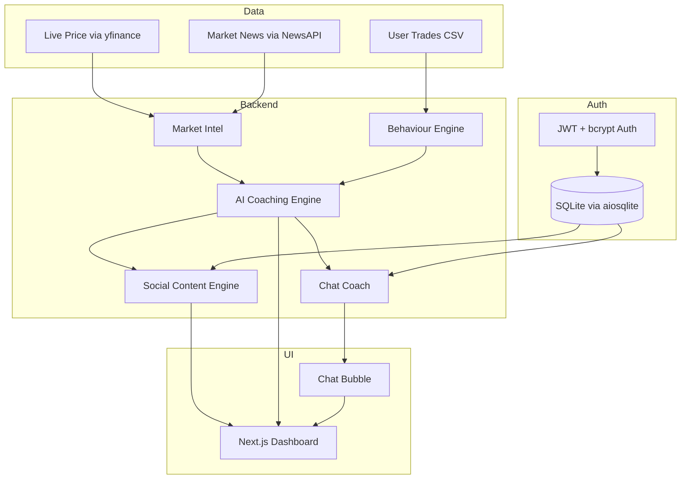

# MarketMind | Intelligent Trading Analyst

AI-powered trading dashboard that helps retail traders understand market moves, analyse their own behaviour, and create trusted social content.

> [English](README.md) | [中文](README.zh-CN.md)

---

## Features

- **Market Intelligence** — Real-time technical indicators (RSI, ATR, Volume Ratio) with AI-generated explanations and coaching messages
- **Behaviour Coaching** — Detects 7 patterns (loss streaks, revenge trading, oversizing, rapid re-entry, consistent sizing, no revenge trades, improving streaks) with risk scoring and CSV upload
- **AI Chat Coach** — Multi-turn conversation with tool use for live market data, persistent chat history
- **Social Content Generator** — 3 persona voices (Calm Analyst, Data Nerd, Trading Coach) for LinkedIn and X, with one-click share and copy
- **Auth & Sessions** — JWT + bcrypt authentication with demo account, protected routes, and history persistence
- **Dark / Light / System Theme** — Class-based theme toggle persisted to localStorage
- **Interactive Price Chart** — Recharts-powered chart with simulate 3% drop and 8% rise

---

## Quick Start

### 1. Backend

```bash
cd backend
python -m venv venv

# macOS/Linux
source venv/bin/activate

# Windows
venv\Scripts\activate

pip install -r requirements.txt
```

Create a `.env` file in the `backend/` directory:

```env
OPENAI_API_KEY=your-openai-api-key      # Required
NEWSAPI_KEY=your-newsapi-key             # Optional (falls back to yfinance news)
MODEL_BASE_URL=                          # Optional (custom OpenAI-compatible endpoint)
```

Start the server:

```bash
uvicorn app.main:app --reload --port 8000
```

### 2. Frontend

```bash
cd frontend
npm install
```

Optionally create `.env.local` in the `frontend/` directory:

```env
NEXT_PUBLIC_API_URL=http://localhost:8000
```

Start the dev server:

```bash
npm run dev
```

### 3. Open

```
http://localhost:3000
```

### 4. Demo Account

```
Email:    demo@trader.com
Password: demo1234
```

---

## Demo Flow

1. Land on the intro page and click **Get Started**
2. Log in with the demo account
3. Explore the **Vision** page (product intro)
4. Navigate to the **Dashboard**, select a symbol, and click **Simulate 3% Drop** or **Simulate 8% Rise**
5. Cards animate in: Market explanation → Behaviour insight → Coaching fusion → Social content (LinkedIn + X per persona)
6. Open the **floating chat bubble** to ask follow-up questions, or visit the full **Chat** page
7. Check the **History** page for past chats and generated content

---

## API Endpoints

All endpoints are prefixed with `/api/v1`.

### Auth

| Method | Path | Description |
|--------|------|-------------|
| POST | `/auth/register` | Register a new user |
| POST | `/auth/login` | Log in, returns JWT |
| GET | `/auth/me` | Get current user (auth required) |
| POST | `/auth/logout` | Log out |

### Market Intelligence

| Method | Path | Description |
|--------|------|-------------|
| GET | `/market` | Market data + AI explanation + optional coaching |
| GET | `/market/chart` | Historical price data for charting |
| GET | `/market/indicators` | Raw technical indicators (RSI, ATR, Volume Ratio) |
| GET | `/market/with-news` | Market data + news headlines |

### Behaviour

| Method | Path | Description |
|--------|------|-------------|
| POST | `/behavior` | Analyse trading behaviour from trade list |
| GET | `/behavior/sample` | Sample analysis using demo trades |

### Coaching Insight

| Method | Path | Description |
|--------|------|-------------|
| POST | `/insight` | Fuse market context + behaviour into coaching message |

### Content

| Method | Path | Description |
|--------|------|-------------|
| POST | `/content` | Generate social content for one persona |
| POST | `/content/all` | Generate content for all 3 personas |
| GET | `/content/personas` | List available personas with descriptions |

### Chat

| Method | Path | Description |
|--------|------|-------------|
| POST | `/chat` | Multi-turn chat with AI (optional auth for persistence) |

### History (auth required)

| Method | Path | Description |
|--------|------|-------------|
| GET | `/history/chat` | Retrieve chat history |
| DELETE | `/history/chat` | Clear chat history |
| GET | `/history/content` | Retrieve generated content history |
| GET | `/history/trades` | Retrieve saved trades |
| POST | `/history/trades` | Save trades to user account |

### Health

| Method | Path | Description |
|--------|------|-------------|
| GET | `/health` | Health check |
| GET | `/` | API info |

---

## Tech Stack

| Layer | Technology |
|-------|------------|
| Backend | FastAPI + yfinance + OpenAI-compatible API + aiosqlite |
| Frontend | Next.js 16 + React 19 + Tailwind CSS v4 + shadcn/ui |
| Auth | JWT (python-jose) + bcrypt (passlib) |
| Charts | Recharts 3 |
| Animation | Framer Motion 12 |
| Data | trades.csv + SQLite (aiosqlite) |
| Infra | Vercel / Cloudflare Pages |
| Dev UX | TypeScript 5, ESLint, hot reload |

---

## Architecture



---

## Project Structure

```
deriv-ai-talent-sprint/
├── backend/
│   ├── app/
│   │   ├── main.py                 # FastAPI entry point
│   │   ├── config.py               # Environment settings
│   │   ├── auth.py                 # JWT + bcrypt helpers
│   │   ├── database.py             # SQLite via aiosqlite
│   │   ├── api/v1/                 # Route handlers
│   │   │   ├── auth.py
│   │   │   ├── market.py
│   │   │   ├── behavior.py
│   │   │   ├── insight.py
│   │   │   ├── content.py
│   │   │   ├── chat.py
│   │   │   └── history.py
│   │   ├── services/               # Business logic
│   │   │   ├── market_intelligence.py
│   │   │   ├── behavior_engine.py
│   │   │   ├── claude_engine.py
│   │   │   └── content_generator.py
│   │   ├── models/                 # Pydantic schemas
│   │   ├── prompts/                # System prompt files
│   │   └── data/trades.csv         # Sample trade data
│   └── requirements.txt
│
├── frontend/
│   ├── src/
│   │   ├── app/
│   │   │   ├── layout.tsx          # Root layout (providers, fonts)
│   │   │   ├── page.tsx            # Landing page
│   │   │   ├── login/page.tsx      # Login page
│   │   │   └── dashboard/
│   │   │       ├── layout.tsx      # Dashboard shell (sidebar, navbar)
│   │   │       ├── page.tsx        # Dashboard home
│   │   │       ├── chat/page.tsx   # Full-page chat
│   │   │       ├── history/page.tsx
│   │   │       ├── settings/page.tsx
│   │   │       └── vision/page.tsx
│   │   ├── components/
│   │   │   ├── auth/               # ProtectedRoute
│   │   │   ├── cards/              # MarketCard, BehaviorCard, InsightCard, ContentCard
│   │   │   ├── charts/             # PriceChart (Recharts)
│   │   │   ├── chat/               # ChatBubble, ChatInput, ChatMessageList
│   │   │   ├── features/           # SimulateButton, SymbolSelector, TradeUpload
│   │   │   ├── layout/             # Navbar, Sidebar
│   │   │   ├── providers/          # AuthProvider, ChatProvider, ThemeProvider
│   │   │   └── ui/                 # shadcn/ui primitives
│   │   ├── hooks/                  # useSessionState
│   │   ├── lib/                    # api.ts, utils.ts
│   │   └── types/                  # Shared TypeScript types
│   └── package.json
│
├── CLAUDE.md
└── README.md
```

---

## Environment Variables

All backend env vars are set in `backend/.env`.

| Variable | Required | Default | Description |
|----------|----------|---------|-------------|
| `OPENAI_API_KEY` | Yes | — | API key for OpenAI-compatible LLM |
| `NEWSAPI_KEY` | No | — | NewsAPI key (falls back to yfinance news) |
| `MODEL` | No | `gpt-5-mini-2025-08-07` | Model name to use |
| `MODEL_BASE_URL` | No | — | Custom base URL for OpenAI-compatible API |
| `CORS_ORIGINS` | No | `["http://localhost:3000", "http://127.0.0.1:3000"]` | Allowed CORS origins (JSON array) |
| `DEFAULT_SYMBOL` | No | `EURUSD=X` | Default trading symbol |
| `JWT_SECRET_KEY` | No | `dev-secret-change-in-production` | Secret key for JWT signing |
| `JWT_ALGORITHM` | No | `HS256` | JWT signing algorithm |
| `JWT_EXPIRY_HOURS` | No | `24` | JWT token expiry in hours |

---

## Troubleshooting

| Issue | Solution |
|-------|----------|
| CORS error | Ensure backend runs on port 8000 |
| No market data | Check internet connection |
| API error | Verify `OPENAI_API_KEY` in `.env` |
| Build error | Run `npm install` again |
| No AI responses | Check `OPENAI_API_KEY` is set and valid |
| Auth fails | Check `JWT_SECRET_KEY` in `.env` |

---

## License

MIT
