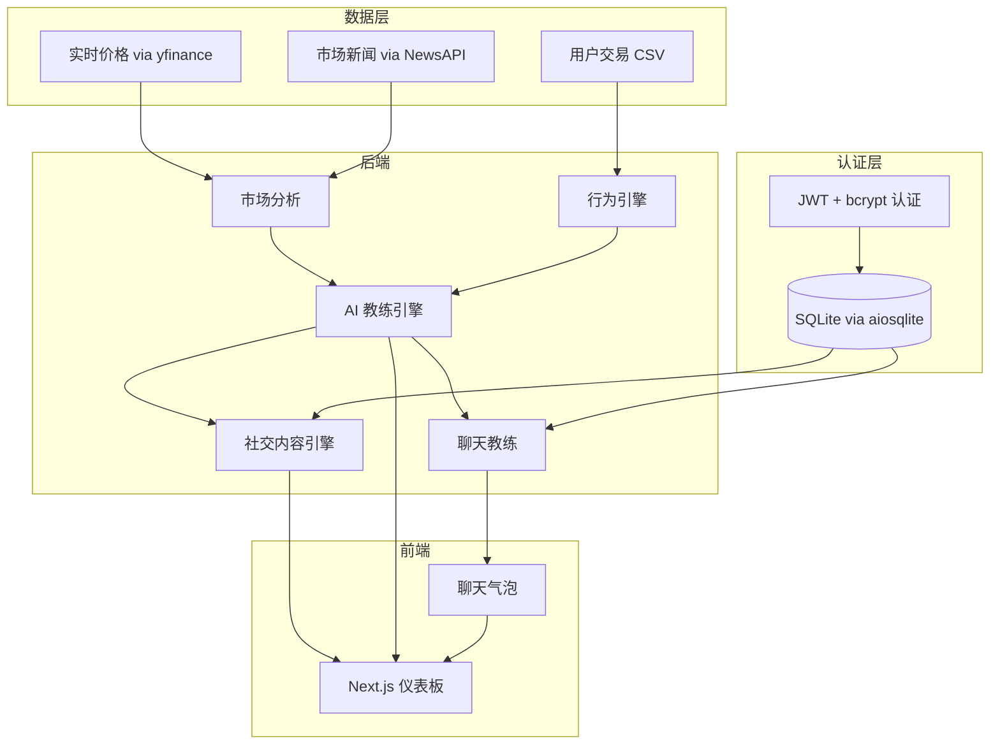

# MarketMind | 智能交易分析师

AI 驱动的交易仪表板，帮助散户交易者理解市场动向、分析自身行为、创建可信赖的社交内容。

> [English](README.md) | [中文](README.zh-CN.md)

---

## 功能特性

- **市场分析** — 实时技术指标（RSI、ATR、成交量比率）配合 AI 生成的解读和辅导消息
- **行为教练** — 检测 7 种模式（连续亏损、报复性交易、超额持仓、快速重入、稳定仓位、无报复交易、连续盈利）并提供风险评分和 CSV 上传
- **AI 聊天教练** — 多轮对话，支持实时市场数据工具调用和聊天记录持久化
- **社交内容生成** — 3 种人设风格（冷静分析师、数据极客、交易教练）适配 LinkedIn 和 X，支持一键分享和复制
- **认证与会话** — JWT + bcrypt 认证，内置演示账户、受保护路由和历史记录持久化
- **深色 / 浅色 / 系统主题** — 基于 class 的主题切换，持久化到 localStorage
- **交互式价格图表** — Recharts 驱动，支持模拟 3% 下跌和 8% 上涨

---

## 快速开始

### 1. 后端

```bash
cd backend
python -m venv venv

# macOS/Linux
source venv/bin/activate

# Windows
venv\Scripts\activate

pip install -r requirements.txt
```

在 `backend/` 目录下创建 `.env` 文件：

```env
OPENAI_API_KEY=your-openai-api-key      # 必填
NEWSAPI_KEY=your-newsapi-key             # 选填（缺省时使用 yfinance 新闻）
MODEL_BASE_URL=                          # 选填（自定义 OpenAI 兼容端点）
```

启动服务：

```bash
uvicorn app.main:app --reload --port 8000
```

### 2. 前端

```bash
cd frontend
npm install
```

可选：在 `frontend/` 目录下创建 `.env.local`：

```env
NEXT_PUBLIC_API_URL=http://localhost:8000
```

启动开发服务器：

```bash
npm run dev
```

### 3. 打开浏览器

```
http://localhost:3000
```

### 4. 演示账户

```
邮箱：  demo@trader.com
密码：  demo1234
```

---

## 演示流程

1. 进入首页，点击 **Get Started**
2. 使用演示账户登录
3. 浏览 **Vision** 页面（产品介绍）
4. 进入 **Dashboard**，选择交易对，点击 **Simulate 3% Drop** 或 **Simulate 8% Rise**
5. 卡片依次动画展示：市场解读 → 行为洞察 → 融合教练 → 社交内容（每个人设生成 LinkedIn + X 帖子）
6. 点击 **浮动聊天气泡** 提问，或访问完整 **Chat** 页面
7. 在 **History** 页面查看历史聊天和生成的内容

---

## API 接口

所有接口路径前缀为 `/api/v1`。

### 认证

| 方法 | 路径 | 描述 |
|------|------|------|
| POST | `/auth/register` | 注册新用户 |
| POST | `/auth/login` | 登录，返回 JWT |
| GET | `/auth/me` | 获取当前用户（需认证） |
| POST | `/auth/logout` | 登出 |

### 市场分析

| 方法 | 路径 | 描述 |
|------|------|------|
| GET | `/market` | 市场数据 + AI 解读 + 可选教练消息 |
| GET | `/market/chart` | 图表历史价格数据 |
| GET | `/market/indicators` | 原始技术指标（RSI、ATR、成交量比率） |
| GET | `/market/with-news` | 市场数据 + 新闻头条 |

### 行为分析

| 方法 | 路径 | 描述 |
|------|------|------|
| POST | `/behavior` | 从交易列表分析交易行为 |
| GET | `/behavior/sample` | 使用演示数据的示例分析 |

### 教练洞察

| 方法 | 路径 | 描述 |
|------|------|------|
| POST | `/insight` | 融合市场上下文与行为生成教练消息 |

### 内容生成

| 方法 | 路径 | 描述 |
|------|------|------|
| POST | `/content` | 为单个人设生成社交内容 |
| POST | `/content/all` | 为全部 3 个人设生成内容 |
| GET | `/content/personas` | 列出可用人设及描述 |

### 聊天

| 方法 | 路径 | 描述 |
|------|------|------|
| POST | `/chat` | 多轮 AI 对话（登录后自动保存历史） |

### 历史记录（需认证）

| 方法 | 路径 | 描述 |
|------|------|------|
| GET | `/history/chat` | 获取聊天历史 |
| DELETE | `/history/chat` | 清除聊天历史 |
| GET | `/history/content` | 获取生成的内容历史 |
| GET | `/history/trades` | 获取已保存的交易记录 |
| POST | `/history/trades` | 保存交易记录到账户 |

### 健康检查

| 方法 | 路径 | 描述 |
|------|------|------|
| GET | `/health` | 健康检查 |
| GET | `/` | API 信息 |

---

## 技术栈

| 层级 | 技术 |
|------|------|
| 后端 | FastAPI + yfinance + OpenAI 兼容 API + aiosqlite |
| 前端 | Next.js 16 + React 19 + Tailwind CSS v4 + shadcn/ui |
| 认证 | JWT (python-jose) + bcrypt (passlib) |
| 图表 | Recharts 3 |
| 动画 | Framer Motion 12 |
| 数据 | trades.csv + SQLite (aiosqlite) |
| 部署 | Vercel / Cloudflare Pages |
| 开发体验 | TypeScript 5、ESLint、热重载 |

---

## 系统架构



---

## 项目结构

```
deriv-ai-talent-sprint/
├── backend/
│   ├── app/
│   │   ├── main.py                 # FastAPI 入口
│   │   ├── config.py               # 环境配置
│   │   ├── auth.py                 # JWT + bcrypt 工具
│   │   ├── database.py             # SQLite via aiosqlite
│   │   ├── api/v1/                 # 路由处理
│   │   │   ├── auth.py
│   │   │   ├── market.py
│   │   │   ├── behavior.py
│   │   │   ├── insight.py
│   │   │   ├── content.py
│   │   │   ├── chat.py
│   │   │   └── history.py
│   │   ├── services/               # 业务逻辑
│   │   │   ├── market_intelligence.py
│   │   │   ├── behavior_engine.py
│   │   │   ├── claude_engine.py
│   │   │   └── content_generator.py
│   │   ├── models/                 # Pydantic 数据模型
│   │   ├── prompts/                # 系统提示词文件
│   │   └── data/trades.csv         # 示例交易数据
│   └── requirements.txt
│
├── frontend/
│   ├── src/
│   │   ├── app/
│   │   │   ├── layout.tsx          # 根布局（providers、字体）
│   │   │   ├── page.tsx            # 着陆页
│   │   │   ├── login/page.tsx      # 登录页
│   │   │   └── dashboard/
│   │   │       ├── layout.tsx      # 仪表板外壳（侧边栏、导航栏）
│   │   │       ├── page.tsx        # 仪表板首页
│   │   │       ├── chat/page.tsx   # 完整聊天页
│   │   │       ├── history/page.tsx
│   │   │       ├── settings/page.tsx
│   │   │       └── vision/page.tsx
│   │   ├── components/
│   │   │   ├── auth/               # ProtectedRoute
│   │   │   ├── cards/              # MarketCard、BehaviorCard、InsightCard、ContentCard
│   │   │   ├── charts/             # PriceChart (Recharts)
│   │   │   ├── chat/               # ChatBubble、ChatInput、ChatMessageList
│   │   │   ├── features/           # SimulateButton、SymbolSelector、TradeUpload
│   │   │   ├── layout/             # Navbar、Sidebar
│   │   │   ├── providers/          # AuthProvider、ChatProvider、ThemeProvider
│   │   │   └── ui/                 # shadcn/ui 基础组件
│   │   ├── hooks/                  # useSessionState
│   │   ├── lib/                    # api.ts、utils.ts
│   │   └── types/                  # 共享 TypeScript 类型
│   └── package.json
│
├── CLAUDE.md
└── README.md
```

---

## 环境变量

所有后端环境变量在 `backend/.env` 中设置。

| 变量 | 必填 | 默认值 | 描述 |
|------|------|--------|------|
| `OPENAI_API_KEY` | 是 | — | OpenAI 兼容 LLM 的 API 密钥 |
| `NEWSAPI_KEY` | 否 | — | NewsAPI 密钥（缺省时使用 yfinance 新闻） |
| `MODEL` | 否 | `gpt-5-mini-2025-08-07` | 使用的模型名称 |
| `MODEL_BASE_URL` | 否 | — | 自定义 OpenAI 兼容 API 的基础 URL |
| `CORS_ORIGINS` | 否 | `["http://localhost:3000", "http://127.0.0.1:3000"]` | 允许的 CORS 来源（JSON 数组） |
| `DEFAULT_SYMBOL` | 否 | `EURUSD=X` | 默认交易对 |
| `JWT_SECRET_KEY` | 否 | `dev-secret-change-in-production` | JWT 签名密钥 |
| `JWT_ALGORITHM` | 否 | `HS256` | JWT 签名算法 |
| `JWT_EXPIRY_HOURS` | 否 | `24` | JWT 令牌过期时间（小时） |

---

## 故障排除

| 问题 | 解决方案 |
|------|----------|
| CORS 跨域错误 | 确保后端运行在 8000 端口 |
| 无市场数据 | 检查网络连接 |
| API 错误 | 检查 `.env` 中的 `OPENAI_API_KEY` |
| 构建错误 | 重新运行 `npm install` |
| 无 AI 回复 | 检查 `OPENAI_API_KEY` 是否设置且有效 |
| 认证失败 | 检查 `.env` 中的 `JWT_SECRET_KEY` |

---

## 许可证

MIT
